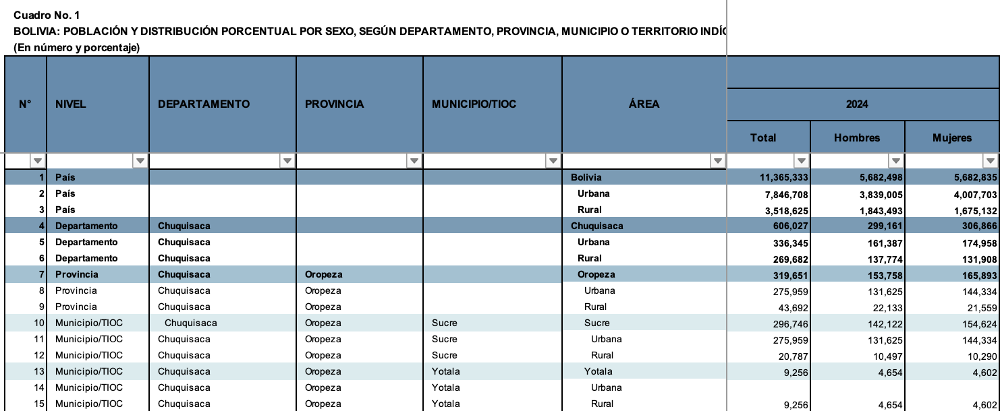

This script ingests the published data tables produced by the Bolivian Instituto Nacional de Estadística ([website](https://www.ine.gob.bo/)\|Wikipedia) based on the 2024 Census, officially the Censo de Población y Vivienda 2024, which is [described in Spanish here](https://cpv2024.ine.gob.bo/index.php/censo-2024/). Data from the Census is published online in both tabulated and microdata (one-person, one-line, without names) format.

In this script, I'm working with the published, tabulated data created by INE rather than producing my own summaries of the microdata. The 18 tabulated datasets ([available here](https://cpv2024.ine.gob.bo/index.php/tabulados-sobre-la-tematica-pobreza/)) are organized by topic and included information for four geographic levels, as well as for rural and urban subsets within each of them. They are formatted into Excel sheets with 1398 lines of data for all of these levels, interleaved in a human readable format.

The advantage of using these documents in that one can cite them directly, rather than introducing my own (unpublished) data analysis into the chain of citation, adding an extra verification step to scholarly publications and to create a non-independent source if used on Wikipedia.

But I still want to be able to automate the process of reading the numbers off these sheets. That's what this script accomplishes.

Here's the format that the script has to untangle:

{fig-alt="A section of an Excel spreadsheet with eight headers and a dozen or so lines, with different levels of detail from \"País\" to \"Municipio/TIOC	Chuquisaca	Oropeza	Yotala	Urbana\""}


```{r setup}
#| message: false
library(readxl)
library(tidyverse)
library(kableExtra)
```

## Part 1: Population by Geography (`POBLACION.xlsx`)

Source: sheet "1" of `POBLACION.xlsx`. The header spans Excel rows 5–7; data begins at row 9. Excel column A is blank and is dropped automatically by `read_excel`, so 24 columns remain (B–Y).

- **Cols 1–6** (B–G): row counter, geographic level, departamento, provincia, municipio, area
- **Cols 7–15** (H–P): population counts for 2001 / 2012 / 2024 × (total, hombre, mujer)
- **Cols 16–24** (Q–Y): derived percentages, same structure

Within each geographic level, rows come in triples: the entity total (area = entity name), then "Urbana", then "Rural".

```{r load-population}
#| message: false
raw <- read_excel(
  "../bolivia-data/censo_2024/POBLACION.xlsx",
  sheet     = "1",
  col_names = FALSE,
  skip      = 8   # rows 1–8: title, three header rows, blank separator
)

col_names <- c(
  "row_num",
  "nivel",
  "departamento",
  "provincia",
  "municipio",
  "area",
  "pop_2001_total",  "pop_2001_hombre",  "pop_2001_mujer",
  "pop_2012_total",  "pop_2012_hombre",  "pop_2012_mujer",
  "pop_2024_total",  "pop_2024_hombre",  "pop_2024_mujer",
  "pct_2001_total",  "pct_2001_hombre",  "pct_2001_mujer",
  "pct_2012_total",  "pct_2012_hombre",  "pct_2012_mujer",
  "pct_2024_total",  "pct_2024_hombre",  "pct_2024_mujer"
)

names(raw) <- col_names

pop_raw <- raw |>
  mutate(
    row_num = as.integer(row_num),
    across(starts_with("pop_") | starts_with("pct_"), as.numeric)
  ) |>
  filter(!is.na(row_num))
```

### Disaggregate by geographic level

Each level has "total" rows (area = entity name) and subdivision rows (area = "Urbana" or "Rural").

```{r disaggregate-population}
subdivisions <- c("Urbana", "Rural")

pop_country        <- pop_raw |> filter(nivel == "País")

pop_dept           <- pop_raw |>
  filter(nivel == "Departamento", !area %in% subdivisions)

pop_dept_urb_rural <- pop_raw |>
  filter(nivel == "Departamento",  area %in% subdivisions)

pop_prov           <- pop_raw |>
  filter(nivel == "Provincia",     !area %in% subdivisions) |> 
  filter(provincia != "Territorio Indígena Multiétnico")

pop_prov_urb_rural <- pop_raw |>
  filter(nivel == "Provincia",      area %in% subdivisions) |> 
  filter(provincia != "Territorio Indígena Multiétnico")

pop_muni           <- pop_raw |>
  filter(nivel == "Municipio/TIOC", !area %in% subdivisions)

pop_muni_urb_rural <- pop_raw |>
  filter(nivel == "Municipio/TIOC",  area %in% subdivisions)
```

```{r expand-prov-lookup-table}
#| eval: false
prov_id_lookup_table <- readRDS("data/prov_id_lookup_table.rds")
prov_id_lookup_long <- prov_id_lookup_table |> 
  pivot_longer(cols = starts_with("province"), names_to = "prov_list", values_to = "province") 
prov_id_lookup <- prov_id_lookup_long |>
  distinct(id_prov, department, province)

pop_prov_with_id <- pop_prov |> left_join(prov_id_lookup, by = c("provincia" = "province", 
                                             "departamento" = "department")) 
pop_prov_with_id |> filter(is.na(id_prov)) |> select(departamento, provincia, id_prov) ->
  pop_prov_missing_id

prov_id_no_match <- prov_id_lookup |> 
  anti_join(pop_prov, by = c("province" = "provincia", 
                             "department" = "departamento"))

# Manual matches: pop_prov_missing_id → id_prov (same dept, similar name)
# Beni / Territorio Indígena Multiétnico is a TIOC with no standard province code
manual_prov_match <- tribble(
  ~provincia,                    ~departamento,  ~id_prov,
  "Sur Yungas",                  "La Paz",       "0211",  # Sud Yungas
  "Sur Lípez",                   "Potosí",       "0510",  # Sur Lipez / Sud Lípez
  "General Bernardino Bilbao",   "Potosí",       "0513",  # General Bilbao
  "Avilez",                      "Tarija",       "0604",  # Avilés
  "Valle Grande",                "Santa Cruz",   "0708",  # Vallegrande
  "Obispo Santisteban",          "Santa Cruz",   "0710",  # Obispo Santistéban
  "Ñuflo de Chávez",             "Santa Cruz",   "0711",  # Ñuflo De Chávez
  "Ángel Sandoval",              "Santa Cruz",   "0712"   # Angel Sandoval
)

# Build cpv2024 name → id_prov lookup from auto-matched + manual rows
cpv_prov_name_lookup <- pop_prov_with_id |>
  filter(!is.na(id_prov)) |>
  select(id_prov, prov_cpv2024 = provincia) |>
  bind_rows(manual_prov_match |> select(id_prov, prov_cpv2024 = provincia)) |>
  distinct(id_prov, .keep_all = TRUE)

# Add prov_cpv2024 column to prov_id_lookup_table
prov_id_lookup_table <- readRDS("data/prov_id_lookup_table.rds") # reload for clean merge
prov_id_lookup_table <- prov_id_lookup_table |>
  left_join(cpv_prov_name_lookup, by = "id_prov") |> 
  relocate(prov_cpv2024, .before=department) |> 
  rename(province_cpv2024 = prov_cpv2024) |>
  # recount distinct province names per department to identify duplicates
  rowwise() |> mutate(
    n_unique = n_distinct(c(province_gb2014, province_anexo, province_census, 
                            province_gadm, province_cpv2024), na.rm = TRUE)
  ) |> 
  ungroup()

# saveRDS(prov_id_lookup_table, "data/prov_id_lookup_table.rds")
# 
# source("src/update-versioned-archive.R")
# update_versioned_archive(prov_id_lookup_table, "../ultimate-consequences/data/prov_id_lookup_table.rds")

```

```{r add-ine-code}
muni_id_lookup_table <- readRDS("data/muni_id_lookup_table.rds")
crosswalk_muni <- muni_id_lookup_table |>
  select(muni_cpv2024, department, id_muni) |>
  rename(ine_code = id_muni)

prov_id_lookup_table <- readRDS("data/prov_id_lookup_table.rds")
crosswalk_prov <- prov_id_lookup_table |>
  select(province_cpv2024, department, id_prov) |>
  rename(ine_code = id_prov)

dep_crosswalk <- crosswalk_prov |>
  mutate(id_dep = str_extract(ine_code, "^\\d{2}")) |>
  select(-province_cpv2024, -ine_code) |> 
  distinct()

add_ine_code_muni <- function(df) {
  df |>
    left_join(crosswalk_muni, by = c("municipio" = "muni_cpv2024", "departamento" = "department")) |>
    relocate(ine_code, municipio, provincia, departamento, area, nivel)
}

add_ine_code_prov <- function(df) {
  df |>
    left_join(crosswalk_prov, by = c("provincia" = "province_cpv2024", "departamento" = "department")) |>
    relocate(ine_code, provincia, departamento, area, nivel) |>
    select(-municipio)
}

add_ine_code_dept <- function(df) {
  df |>
    left_join(dep_crosswalk, by = c("departamento" = "department")) |>
    relocate(id_dep, departamento, area, nivel) |>
    select(-provincia, -municipio)
}

pop_muni           <- add_ine_code_muni(pop_muni)
pop_muni_urb_rural <- add_ine_code_muni(pop_muni_urb_rural)
pop_prov           <- add_ine_code_prov(pop_prov)
pop_prov_urb_rural <- add_ine_code_prov(pop_prov_urb_rural)
pop_dept           <- add_ine_code_dept(pop_dept)
pop_dept_urb_rural <- add_ine_code_dept(pop_dept_urb_rural)
```

### Quick checks

```{r checks-population}
#| echo: false
#| asis: true
cat("Country rows:           ", nrow(pop_country),       "\n")
cat("Dept totals:            ", nrow(pop_dept),           "\n")
cat("Dept urban+rural rows:  ", nrow(pop_dept_urb_rural), "\n")
cat("Province totals:        ", nrow(pop_prov),           "\n")
cat("Province urban+rural:   ", nrow(pop_prov_urb_rural), "\n")
cat("Municipality totals:    ", nrow(pop_muni),           "\n")
cat("Municipality urb+rural: ", nrow(pop_muni_urb_rural), "\n")
```

```{r preview-dept}
pop_dept |>
  select(departamento, pop_2024_total, pop_2024_hombre, pop_2024_mujer) |>
  kbl() |> kable_classic()
```

```{r preview-muni}
pop_muni |>
  select(departamento, provincia, municipio, pop_2024_total, pop_2024_hombre, pop_2024_mujer) |>
  head(12) |>
  kbl() |> kable_classic()
```

### Save population outputs

```{r prep-for-saving}
#| echo: true

# These have all Spanish names except for "pop" which should be "pob"
es_var_name_fix <- function(x) {
  x |> rename_with(~ stringr::str_replace(., "^pop", "pob"), starts_with("pop"))
}

pop_raw_es <- es_var_name_fix(pop_raw)
pop_country_es <- es_var_name_fix(pop_country)
pop_dept_es <- es_var_name_fix(pop_dept)
pop_dept_urb_rural_es <- es_var_name_fix(pop_dept_urb_rural)
pop_prov_es <- es_var_name_fix(pop_prov)
pop_prov_urb_rural_es <- es_var_name_fix(pop_prov_urb_rural)
pop_muni_es <- es_var_name_fix(pop_muni)
pop_muni_urb_rural_es <- es_var_name_fix(pop_muni_urb_rural)

english_var_name_fix <- function(x) {
  x |>
    rename(
      department = any_of("departamento"),
      province = any_of("provincia"),
      municipality = any_of("municipio"),
      level = any_of("nivel")
    ) |>
    rename_with(~ stringr::str_replace(., "_mujer", "_female"), ends_with("mujer")) |>
    rename_with(~ stringr::str_replace(., "_hombre", "_male"), ends_with("hombre"))
}

pop_raw_en <- english_var_name_fix(pop_raw)
pop_country_en <- english_var_name_fix(pop_country)
pop_dept_en <- english_var_name_fix(pop_dept)
pop_dept_urb_rural_en <- english_var_name_fix(pop_dept_urb_rural)
pop_prov_en <- english_var_name_fix(pop_prov)
pop_prov_urb_rural_en <- english_var_name_fix(pop_prov_urb_rural)
pop_muni_en <- english_var_name_fix(pop_muni)
pop_muni_urb_rural_en <- english_var_name_fix(pop_muni_urb_rural)

```

```{r checks-output}
#| echo: false
#| asis: true
cat("English output datasets:\n")
cat("Country rows:           ", nrow(pop_country_en),        "\n")
cat("Dept totals:            ", nrow(pop_dept_en),            "\n")
cat("Dept urban+rural rows:  ", nrow(pop_dept_urb_rural_en),  "\n")
cat("Province totals:        ", nrow(pop_prov_en),            "\n")
cat("Province urban+rural:   ", nrow(pop_prov_urb_rural_en),  "\n")
cat("Municipality totals:    ", nrow(pop_muni_en),            "\n")
cat("Municipality urb+rural: ", nrow(pop_muni_urb_rural_en),  "\n")

cat("\nSpanish output datasets:\n")
cat("Country rows:           ", nrow(pop_country_es),        "\n")
cat("Dept totals:            ", nrow(pop_dept_es),            "\n")
cat("Dept urban+rural rows:  ", nrow(pop_dept_urb_rural_es),  "\n")
cat("Province totals:        ", nrow(pop_prov_es),            "\n")
cat("Province urban+rural:   ", nrow(pop_prov_urb_rural_es),  "\n")
cat("Municipality totals:    ", nrow(pop_muni_es),            "\n")
cat("Municipality urb+rural: ", nrow(pop_muni_urb_rural_es),  "\n")
```

```{r save-population-data }
#| eval: false
#| echo: true

# This code will not be run, since the data is already saved.
saveRDS(pop_raw_es,           "data/cpv2024/poblacion_raw.rds")
saveRDS(pop_country_es,       "data/cpv2024/poblacion_pais.rds")
saveRDS(pop_dept_es,          "data/cpv2024/poblacion_departamento.rds")
saveRDS(pop_dept_urb_rural_es,"data/cpv2024/poblacion_departamento_urb_rural.rds")
saveRDS(pop_prov_es,          "data/cpv2024/poblacion_provincia.rds")
saveRDS(pop_prov_urb_rural_es,"data/cpv2024/poblacion_provincia_urb_rural.rds")
saveRDS(pop_muni_es,          "data/cpv2024/poblacion_municipio.rds")
saveRDS(pop_muni_urb_rural_es,"data/cpv2024/poblacion_municipio_urb_rural.rds")

# This code will not be run, since the data is already saved.
saveRDS(pop_raw_en,           "data/cpv2024/population_raw.rds")
saveRDS(pop_country_en,       "data/cpv2024/population_country.rds")
saveRDS(pop_dept_en,          "data/cpv2024/population_department.rds")
saveRDS(pop_dept_urb_rural_en,"data/cpv2024/population_department_urb_rural.rds")
saveRDS(pop_prov_en,          "data/cpv2024/population_province.rds")
saveRDS(pop_prov_urb_rural_en,"data/cpv2024/population_province_urb_rural.rds")
saveRDS(pop_muni_en,          "data/cpv2024/population_municipality.rds")
saveRDS(pop_muni_urb_rural_en,"data/cpv2024/population_municipality_urb_rural.rds")

```

------------------------------------------------------------------------

## Part 2: Ethnic Self-Identification (`AUTOIDENTIFICACION.xlsx`, sheet 3)

Source: sheet "3" of `AUTOIDENTIFICACION.xlsx`. This table reports, for each geographic unit and urban/rural subdivision, the number of people who declared belonging to each of 133 indigenous nations, pueblos, and ethnic categories in the 2024 census. The `total` column is the count of all declarations (a person who identified with multiple groups is counted once per declaration).

The header spans two rows (Excel rows 5–6):

- **Row 5** geographic keys + `TOTAL` + merged header "DECLARACIONES DE AUTOIDENTIFICACIÓN CENSO 2024" spanning all ethnic-group columns.
- **Row 6** individual ethnic-group names (133 names, cols 7–139).

Data begins at row 7. Footnote rows at the bottom of the sheet (with long `nivel` strings) are removed during cleaning.

```{r load-autoidentificacion}
#| message: false
auto_path <- "../bolivia-data/censo_2024/AUTOIDENTIFICACION.xlsx"

# Row 6 of the sheet holds the 133 ethnic-group names; those become the trailing
# column names. Read it separately before reading the data.
ethnic_group_names <- read_excel(
  auto_path,
  sheet     = "3",
  col_names = FALSE,
  skip      = 5,   # skip rows 1–5; row 6 is the one we want
  n_max     = 1
) |>
  unlist(use.names = FALSE)

# Assemble the full column-name vector: 6 geographic keys + 133 ethnic groups.
auto_col_names <- c(
  "nivel", "departamento", "provincia", "municipio", "area", "total",
  ethnic_group_names
)

# Read data rows (starting at Excel row 7).
auto_raw <- read_excel(
  auto_path,
  sheet     = "3",
  col_names = FALSE,
  skip      = 6
)
names(auto_raw) <- auto_col_names

auto_raw <- auto_raw |>
  mutate(across(c(total, all_of(ethnic_group_names)), as.numeric)) |>
  # Drop footnote rows: they have very long nivel strings, not short level names
  filter(!is.na(nivel), nchar(nivel) <= 20)
```

### Disaggregate by geographic level

The row structure mirrors Part 1: each geographic entity appears three times (total, Urbana, Rural). The `nivel` labels used here are identical to those in `POBLACION.xlsx`.

```{r disaggregate-autoidentificacion}
auto_country        <- auto_raw |> filter(nivel == "País",            !area %in% subdivisions)

auto_dept           <- auto_raw |>
  filter(nivel == "Departamento", !area %in% subdivisions)

auto_dept_urb_rural <- auto_raw |>
  filter(nivel == "Departamento",  area %in% subdivisions)

auto_prov           <- auto_raw |>
  filter(nivel == "Provincia",     !area %in% subdivisions)

auto_prov_urb_rural <- auto_raw |>
  filter(nivel == "Provincia",      area %in% subdivisions)

auto_muni           <- auto_raw |>
  filter(nivel == "Municipio/TIOC", !area %in% subdivisions)

auto_muni_urb_rural <- auto_raw |>
  filter(nivel == "Municipio/TIOC",  area %in% subdivisions)
```

```{r add-ine-code-autoidentificacion}
auto_muni           <- add_ine_code_muni(auto_muni)
auto_muni_urb_rural <- add_ine_code_muni(auto_muni_urb_rural)
auto_prov           <- add_ine_code_prov(auto_prov)
auto_prov_urb_rural <- add_ine_code_prov(auto_prov_urb_rural)
auto_dept           <- add_ine_code_dept(auto_dept)
auto_dept_urb_rural <- add_ine_code_dept(auto_dept_urb_rural)
```

### Quick checks

```{r checks-autoidentificacion}
#| echo: false
#| asis: true
cat("Country rows:           ", nrow(auto_country),       "\n")
cat("Dept totals:            ", nrow(auto_dept),           "\n")
cat("Dept urban+rural rows:  ", nrow(auto_dept_urb_rural), "\n")
cat("Province totals:        ", nrow(auto_prov),           "\n")
cat("Province urban+rural:   ", nrow(auto_prov_urb_rural), "\n")
cat("Municipality totals:    ", nrow(auto_muni),           "\n")
cat("Municipality urb+rural: ", nrow(auto_muni_urb_rural), "\n")
```

```{r preview-auto-dept}
# Total declarations by department (top 5 groups)
top5 <- auto_muni |>
  select(all_of(ethnic_group_names)) |>
  summarise(across(everything(), sum, na.rm = TRUE)) |>
  pivot_longer(everything(), names_to = "grupo", values_to = "n") |>
  slice_max(n, n = 5)

auto_dept |>
  select(departamento, total, Quechua, Aymara, Chiquitano, Guaraní, Mojeño) |>
  arrange(desc(total)) |>
  kbl() |> kable_classic()
```

```{r preview-auto-muni}
auto_muni |>
  select(departamento, provincia, municipio, total, Quechua, Aymara) |>
  arrange(desc(total)) |> 
  head(12) |>
  kbl() |> kable_classic()
```

### Save ethnic identification outputs

```{r save-autoidentificacion}
#| eval: false
#| echo: true
# This code will not be run, since the data is already saved.
saveRDS(auto_raw,           "data/cpv2024/autoidentificacion_raw.rds")
saveRDS(auto_country,       "data/cpv2024/autoidentificacion_pais.rds")
saveRDS(auto_dept,          "data/cpv2024/autoidentificacion_departamento.rds")
saveRDS(auto_dept_urb_rural,"data/cpv2024/autoidentificacion_departamento_urb_rural.rds")
saveRDS(auto_prov,          "data/cpv2024/autoidentificacion_provincia.rds")
saveRDS(auto_prov_urb_rural,"data/cpv2024/autoidentificacion_provincia_urb_rural.rds")
saveRDS(auto_muni,          "data/cpv2024/autoidentificacion_municipio.rds")
saveRDS(auto_muni_urb_rural,"data/cpv2024/autoidentificacion_municipio_urb_rural.rds")

auto_raw_en <- english_var_name_fix(auto_raw)
auto_country_en <- english_var_name_fix(auto_country)
auto_dept_en <- english_var_name_fix(auto_dept)
auto_dept_urb_rural_en <- english_var_name_fix(auto_dept_urb_rural)
auto_prov_en <- english_var_name_fix(auto_prov)
auto_prov_urb_rural_en <- english_var_name_fix(auto_prov_urb_rural)
auto_muni_en <- english_var_name_fix(auto_muni)
auto_muni_urb_rural_en <- english_var_name_fix(auto_muni_urb_rural)

# This code will not be run, since the data is already saved.
saveRDS(auto_raw_en,           "data/cpv2024/autoidentificacion_raw.rds")
saveRDS(auto_country_en,       "data/cpv2024/autoidentificacion_country.rds")
saveRDS(auto_dept_en,          "data/cpv2024/autoidentificacion_department.rds")
saveRDS(auto_dept_urb_rural_en,"data/cpv2024/autoidentificacion_department_urb_rural.rds")
saveRDS(auto_prov_en,          "data/cpv2024/autoidentificacion_province.rds")
saveRDS(auto_prov_urb_rural_en,"data/cpv2024/autoidentificacion_province_urb_rural.rds")
saveRDS(auto_muni_en,          "data/cpv2024/autoidentificacion_municipality.rds")
saveRDS(auto_muni_urb_rural_en,"data/cpv2024/autoidentificacion_municipality_urb_rural.rds")
```

------------------------------------------------------------------------

## Part 3: Language Use and Functionalizing the Process

### Helper functions

```{r part3-helpers}
# ── Constants ────────────────────────────────────────────────────────────────

# Group suffix map: cleaned group label → suffix appended to language name.
# Empty string = no suffix (Idiomas oficiales is the default group).
default_group_suffix_map <- c(
  "idiomas_oficiales"   = "",
  "idioma_oficiales"    = "",    # typo present in 2024 section of IDIOMAS_2
  "idiomas_extranjeros" = "ext"
)

# Subdivision values keyed by the last_var column name.
last_var_subdivisions <- list(
  area = c("Urbana", "Rural"),
  sexo = c("Hombres", "Mujeres")
)

# ── clean_label ───────────────────────────────────────────────────────────────
# Normalise a string for use as a column name segment:
# strip footnote markers (e.g. "(2)") → lowercase → strip accents →
# non-alphanumeric runs → "_" → trim edge "_"
clean_label <- function(x) {
  x |>
    (\(s) gsub("\\(\\d+\\)", "", s))() |>   # remove footnote markers like (2), (4)
    tolower() |>
    stringi::stri_trans_general("Latin-ASCII") |>
    (\(s) gsub("[^a-z0-9]+", "_", s))() |>
    (\(s) gsub("^_+|_+$", "", s))()
}

# ── parse_tab_headers ─────────────────────────────────────────────────────────
# Reads the multi-row header block and returns a character vector of column
# names, constructed bottom-to-top:
#   individual language name → group suffix → year
#
# For aggregate columns (no language name in the deepest row), the cleaned
# group label is used as the base name instead.
#
# Parameters:
#   header_skip      Excel rows to skip before the year-label row.
#                    Default 4: row 5 = year, row 6 = group, row 7 = lang.
#   n_geo_cols       Fixed geo columns at the left (default 5).
#   last_var         Name for the 5th geo column (default "area").
#   group_suffix_map Named character vector: clean group label → suffix string.
parse_tab_headers <- function(
    path,
    sheet,
    n_geo_cols       = 5,
    header_skip      = 4,
    last_var         = "area",
    geo_col_names    = NULL,      # override default geo column names if needed
    group_suffix_map = default_group_suffix_map
) {
  if (is.null(geo_col_names))
    geo_col_names <- c("nivel", "departamento", "provincia", "municipio", last_var)
  stopifnot(length(geo_col_names) == n_geo_cols)

  h <- read_excel(path, sheet = sheet, col_names = FALSE,
                  skip = header_skip, n_max = 3)

  data_names <- h |>
    mutate(hrow = row_number()) |>
    pivot_longer(-hrow, names_to = "col", values_to = "val") |>
    mutate(col_pos = as.integer(str_extract(col, "\\d+"))) |>
    filter(col_pos > n_geo_cols) |>
    select(hrow, col_pos, val) |>
    pivot_wider(names_from = hrow, values_from = val, names_prefix = "row") |>
    arrange(col_pos) |>
    # row1 = year, row2 = group — both use merged cells, so fill forward NAs
    fill(row1, row2, .direction = "down") |>
    mutate(
      year_c  = clean_label(row1),
      group_c = clean_label(row2),
      lang_c  = if_else(!is.na(row3), clean_label(row3), NA_character_),
      suffix  = unname(group_suffix_map[group_c]),
      col_name = case_when(
        # Aggregate column: the group itself is the variable
        is.na(lang_c)            ~ paste(group_c, year_c, sep = "_"),
        # Regular column, default group (no suffix or unknown group)
        is.na(suffix) | suffix == "" ~ paste(lang_c, year_c, sep = "_"),
        # Regular column with an explicit suffix (e.g. "ext")
        TRUE                     ~ paste(lang_c, suffix, year_c, sep = "_")
      )
    ) |>
    pull(col_name)

  c(geo_col_names, data_names)
}

# ── read_tab_raw ──────────────────────────────────────────────────────────────
# Loads one Excel sheet using parse_tab_headers() for column names, then
# performs standard row-level cleaning (drop NA nivel, drop footnote rows).
#
# data_skip: Excel rows to skip before data begins (default 7 for IDIOMAS_2).
read_tab_raw <- function(
    path,
    sheet,
    stem,
    n_geo_cols       = 5,
    header_skip      = 4,
    data_skip        = 7,
    last_var         = "area",
    group_suffix_map = default_group_suffix_map
) {
  col_names <- parse_tab_headers(
    path, sheet,
    n_geo_cols       = n_geo_cols,
    header_skip      = header_skip,
    last_var         = last_var,
    group_suffix_map = group_suffix_map
  )

  df <- read_excel(path, sheet = sheet, col_names = FALSE, skip = data_skip)
  names(df) <- col_names

  df |>
    mutate(across(-all_of(col_names[seq_len(n_geo_cols)]), as.numeric)) |>
    filter(!is.na(nivel), nchar(nivel) <= 20)
}

# ── disaggregate_tab ──────────────────────────────────────────────────────────
# Splits a raw frame into a named list of geographic slices.
#
# last_var controls both the subdivision column name and which values count as
# subdivisions (looked up from last_var_subdivisions):
#   "area" (default) → c("Urbana", "Rural"),  keys: *_urb_rural
#   "sexo"           → c("Hombres", "Mujeres"), keys: *_sexo
disaggregate_tab <- function(raw_df, last_var = "area") {
  subdivisions <- last_var_subdivisions[[last_var]]
  if (is.null(subdivisions)) {
    stop("Unknown last_var '", last_var, "'. Known: ",
         paste(names(last_var_subdivisions), collapse = ", "))
  }
  sub_suffix <- switch(last_var, area = "urb_rural", sexo = "sexo", last_var)

  is_sub  <- function(df) df[[last_var]] %in% subdivisions
  drop_tim <- function(df) filter(df, provincia != "Territorio Indígena Multiétnico")

  level_map <- c(dept = "Departamento", prov = "Provincia", muni = "Municipio/TIOC")

  lst <- list(
    raw     = raw_df,
    country = filter(raw_df, nivel == "País")
  )

  for (key in names(level_map)) {
    base <- filter(raw_df, nivel == level_map[[key]])
    if (key == "prov") base <- drop_tim(base)
    lst[[key]]                               <- filter(base, !is_sub(base))
    lst[[paste(key, sub_suffix, sep = "_")]] <- filter(base,  is_sub(base))
  }
  lst
}

# ── attach_ine_codes ──────────────────────────────────────────────────────────
# Applies add_ine_code_dept/prov/muni() to matching list slots.
# last_var: if not "area", temporarily renames the column to "area" before
# calling the helpers (which hardcode that name) and renames it back after.
attach_ine_codes <- function(lst, last_var = "area") {
  needs_rename <- last_var != "area"
  prep   <- function(df) if (needs_rename) rename(df, area = all_of(last_var)) else df
  unprep <- function(df) if (needs_rename) rename(df, !!last_var := area) else df

  for (key in names(lst)) {
    if (!is.data.frame(lst[[key]])) next
    if (startsWith(key, "dept")) lst[[key]] <- unprep(add_ine_code_dept(prep(lst[[key]])))
    if (startsWith(key, "prov")) lst[[key]] <- unprep(add_ine_code_prov(prep(lst[[key]])))
    if (startsWith(key, "muni")) lst[[key]] <- unprep(add_ine_code_muni(prep(lst[[key]])))
  }
  lst
}

# ── save_tab ──────────────────────────────────────────────────────────────────
# Saves each data-frame slot as {dir}/{stem}_{key}.rds.
#
# save_last_var_only: if TRUE, only save slots whose key contains last_var
# (e.g. "dept_sexo", "prov_sexo", "muni_sexo"). Use this when a second
# breakdown (sex) shares a stem with an existing breakdown (area) to avoid
# overwriting the totals and the other subdivision's files.
save_tab <- function(lst, stem, dir = "data/cpv2024/",
                     last_var = NULL, save_last_var_only = FALSE) {
  for (key in names(lst)) {
    if (!is.data.frame(lst[[key]])) next
    if (save_last_var_only && !is.null(last_var) && !grepl(last_var, key)) next
    saveRDS(lst[[key]], file.path(dir, paste0(stem, "_", key, ".rds")))
  }
  invisible(lst)
}
```

### Language declared spoken (`IDIOMAS_2.xlsx`, sheet "8")

Source: sheet "8" of `IDIOMAS_2.xlsx`. This table counts, for each geographic unit and urban/rural subdivision, how many people declared speaking each language in 2012 and 2024. The header spans three rows (Excel rows 5–7): year block (2012 / 2024), group within year (Idiomas oficiales / Idiomas extranjeros / aggregate subtotals), and individual language name.

```{r load-idiomas-hablados}
#| message: false
path_idiomas2 <- "../bolivia-data/censo_2024_reportes/tabulados_descarga_completa/IDIOMAS_2.xlsx"

idiomas_hablados_raw <- read_tab_raw(
  path  = path_idiomas2,
  sheet = "8",
  stem  = "idiomas_hablados"
)
```

```{r disaggregate-idiomas-hablados}
idiomas_hablados <- idiomas_hablados_raw |>
  disaggregate_tab(last_var = "area") |>
  attach_ine_codes()
```

### Quick checks

```{r checks-idiomas-hablados}
#| echo: false
#| asis: true
cat("Raw rows:               ", nrow(idiomas_hablados$raw),            "\n")
cat("Country rows:           ", nrow(idiomas_hablados$country),        "\n")
cat("Dept totals:            ", nrow(idiomas_hablados$dept),           "\n")
cat("Dept urb+rural:         ", nrow(idiomas_hablados$dept_urb_rural), "\n")
cat("Province totals:        ", nrow(idiomas_hablados$prov),           "\n")
cat("Province urb+rural:     ", nrow(idiomas_hablados$prov_urb_rural), "\n")
cat("Municipality totals:    ", nrow(idiomas_hablados$muni),           "\n")
cat("Municipality urb+rural: ", nrow(idiomas_hablados$muni_urb_rural), "\n")
```

```{r preview-col-names-idiomas}
# Verify naming convention: first 12 data column names
names(idiomas_hablados$raw)[6:17]
names(idiomas_hablados$raw)[80:92]
```

```{r preview-idiomas-dept}
idiomas_hablados$dept |>
  select(departamento, castellano_2024, quechua_2024, aymara_2024, guarani_2024, kabinena_2024) |>
  arrange(desc(castellano_2024)) |>
  kbl() |> kable_classic()
```

### Save language outputs

```{r save-idiomas-hablados}
#| eval: false
#| echo: true

# ── Spanish ──────────────────────────────────────────────────────────────────
save_tab(idiomas_hablados, "idiomas_hablados")

# ── English ──────────────────────────────────────────────────────────────────
idiomas_hablados_en <- lapply(idiomas_hablados, function(df) {
  if (!is.data.frame(df)) return(df)
  english_var_name_fix(df)
})
save_tab(idiomas_hablados_en, "languages_spoken")
```

------------------------------------------------------------------------

## Part 4: Languages Spoken by Sex (`IDIOMAS_2.xlsx`, sheet "7")

Source: sheet "7" of `IDIOMAS_2.xlsx`. Same language counts as Part 3, but the within-entity breakdown is by sex (Hombres / Mujeres) rather than area. The 5th geo column is `SEXO`; total rows carry the geographic name in that column.

```{r load-idiomas-hablados-s}
#| message: false
idiomas_hablados_s_raw <- read_tab_raw(
  path     = path_idiomas2,
  sheet    = "7",
  stem     = "idiomas_hablados_s",
  last_var = "sexo"
)
```

```{r disaggregate-idiomas-hablados-s}
idiomas_hablados_s <- idiomas_hablados_s_raw |>
  disaggregate_tab(last_var = "sexo") |>
  attach_ine_codes(last_var = "sexo")
```

### Quick checks

```{r checks-idiomas-hablados-s}
#| echo: false
#| asis: true
cat("Raw rows:          ", nrow(idiomas_hablados_s$raw),        "\n")
cat("Country rows:      ", nrow(idiomas_hablados_s$country),    "\n")
cat("Dept totals:       ", nrow(idiomas_hablados_s$dept),       "\n")
cat("Dept by sex:       ", nrow(idiomas_hablados_s$dept_sexo),  "\n")
cat("Province totals:   ", nrow(idiomas_hablados_s$prov),       "\n")
cat("Province by sex:   ", nrow(idiomas_hablados_s$prov_sexo),  "\n")
cat("Muni totals:       ", nrow(idiomas_hablados_s$muni),       "\n")
cat("Muni by sex:       ", nrow(idiomas_hablados_s$muni_sexo),  "\n")
```

```{r preview-idiomas-s-dept}
idiomas_hablados_s$dept_sexo |>
  select(departamento, sexo, castellano_2024, quechua_2024, aymara_2024) |>
  arrange(departamento, sexo) |>
  head(18) |>
  kbl() |> kable_classic()
```

### Save

```{r save-idiomas-hablados-s}
#| eval: false
#| echo: true

# ── Spanish ──────────────────────────────────────────────────────────────────
# Use the shared stem; save_last_var_only keeps only the *_sexo slots,
# leaving the area-breakdown files from Part 3 untouched.
save_tab(idiomas_hablados_s, "idiomas_hablados",
         last_var = "sexo", save_last_var_only = TRUE)

# ── English ──────────────────────────────────────────────────────────────────
idiomas_hablados_s_en <- lapply(idiomas_hablados_s, function(df) {
  if (!is.data.frame(df)) return(df)
  english_var_name_fix(df) |>
    rename(sex = any_of("sexo"))
})
save_tab(idiomas_hablados_s_en, "languages_spoken",
         last_var = "sexo", save_last_var_only = TRUE)
```

------------------------------------------------------------------------

## Part 5: Population by Age Group (`POBLACION.xlsx`, sheet "3")

Source: sheet "3" of `POBLACION.xlsx`. This table reports population by quinquennial age group (0–4 through 95+) for each geographic unit, with separate blocks for total, urban, and rural populations. Unlike the other sheets, the 6th column (`age_area`) serves double duty: it carries area markers ("Urbana", "Rural", or the entity name for totals) **and** age-group labels within each block.

Each geographic entity therefore spans 63 rows:

- **Total block** (21 rows): entity name, then 20 age groups
- **Urbana block** (21 rows): "Urbana", then 20 age groups
- **Rural block** (21 rows): "Rural", then 20 age groups

Data columns are simpler than sheet "1": population counts only (no percentages), giving 9 data columns (2001 / 2012 / 2024 × total / hombre / mujer).

```{r load-population-age}
#| message: false
age_groups <- c(
  "0 a 4", "5 a 9", "10 a 14", "15 a 19", "20 a 24", "25 a 29",
  "30 a 34", "35 a 39", "40 a 44", "45 a 49", "50 a 54", "55 a 59",
  "60 a 64", "65 a 69", "70 a 74", "75 a 79", "80 a 84", "85 a 89",
  "90 a 94", "95 o más"
)

raw_age <- read_excel(
  "../bolivia-data/censo_2024/POBLACION.xlsx",
  sheet     = "3",
  col_names = FALSE,
  skip      = 7
)

age_col_names <- c(
  "row_num", "nivel", "departamento", "provincia", "municipio", "age_area",
  "pop_2001_total", "pop_2001_hombre", "pop_2001_mujer",
  "pop_2012_total", "pop_2012_hombre", "pop_2012_mujer",
  "pop_2024_total", "pop_2024_hombre", "pop_2024_mujer"
)

names(raw_age) <- age_col_names

raw_age <- raw_age |>
  mutate(
    row_num = as.integer(row_num),
    across(starts_with("pop_"), as.numeric)
  ) |>
  filter(!is.na(row_num))
```

### Parse area and age group

The `age_area` column encodes both the area (total / Urbana / Rural) and the age group. Area-marker rows carry the entity name or "Urbana" / "Rural"; the subsequent 20 rows in each block carry age-group labels. We assign `area` by forward-filling from these markers.

```{r parse-area-age}
pop_age_raw <- raw_age |>
  mutate(
    is_age_group = age_area %in% age_groups,
    # Area markers: "Urbana", "Rural", or the entity-name total row
    area = case_when(
      age_area == "Urbana" ~ "Urbana",
      age_area == "Rural"  ~ "Rural",
      !is_age_group        ~ "Total",
      TRUE                 ~ NA_character_
    )
  ) |>
  fill(area, .direction = "down") |>
  mutate(
    grupo_edad = if_else(is_age_group, age_area, "Total")
  ) |>
  select(-age_area, -is_age_group) |>
  relocate(area, grupo_edad, .after = municipio)
```

### Disaggregate by geographic level

```{r disaggregate-population-age}
subdivisions_age <- c("Urbana", "Rural")

pop_age_country <- pop_age_raw |> filter(nivel == "País")

pop_age_dept <- pop_age_raw |>
  filter(nivel == "Departamento", !area %in% subdivisions_age)

pop_age_dept_urb_rural <- pop_age_raw |>
  filter(nivel == "Departamento", area %in% subdivisions_age)

pop_age_prov <- pop_age_raw |>
  filter(nivel == "Provincia", !area %in% subdivisions_age) |>
  filter(provincia != "Territorio Indígena Multiétnico")

pop_age_prov_urb_rural <- pop_age_raw |>
  filter(nivel == "Provincia", area %in% subdivisions_age) |>
  filter(provincia != "Territorio Indígena Multiétnico")

pop_age_muni <- pop_age_raw |>
  filter(nivel == "Municipio/TIOC", !area %in% subdivisions_age)

pop_age_muni_urb_rural <- pop_age_raw |>
  filter(nivel == "Municipio/TIOC", area %in% subdivisions_age)
```

```{r add-ine-code-population-age}
# The add_ine_code helpers expect an "area" column; here we already have one
# but it holds "Total" for the total rows. Temporarily swap it for the helpers.
add_ine_code_muni_age <- function(df) {
  df |>
    left_join(crosswalk_muni, by = c("municipio" = "muni_cpv2024",
                                     "departamento" = "department")) |>
    relocate(ine_code, municipio, provincia, departamento, area, grupo_edad, nivel)
}

add_ine_code_prov_age <- function(df) {
  df |>
    left_join(crosswalk_prov, by = c("provincia" = "province_cpv2024",
                                     "departamento" = "department")) |>
    relocate(ine_code, provincia, departamento, area, grupo_edad, nivel) |>
    select(-municipio)
}

add_ine_code_dept_age <- function(df) {
  df |>
    left_join(dep_crosswalk, by = c("departamento" = "department")) |>
    relocate(id_dep, departamento, area, grupo_edad, nivel) |>
    select(-provincia, -municipio)
}

pop_age_muni           <- add_ine_code_muni_age(pop_age_muni)
pop_age_muni_urb_rural <- add_ine_code_muni_age(pop_age_muni_urb_rural)
pop_age_prov           <- add_ine_code_prov_age(pop_age_prov)
pop_age_prov_urb_rural <- add_ine_code_prov_age(pop_age_prov_urb_rural)
pop_age_dept           <- add_ine_code_dept_age(pop_age_dept)
pop_age_dept_urb_rural <- add_ine_code_dept_age(pop_age_dept_urb_rural)
```

### Quick checks

```{r checks-population-age}
#| echo: false
#| asis: true
cat("Raw rows:               ", nrow(pop_age_raw),            "\n")
cat("Country rows:           ", nrow(pop_age_country),        "\n")
cat("Dept totals:            ", nrow(pop_age_dept),           "\n")
cat("Dept urban+rural rows:  ", nrow(pop_age_dept_urb_rural), "\n")
cat("Province totals:        ", nrow(pop_age_prov),           "\n")
cat("Province urban+rural:   ", nrow(pop_age_prov_urb_rural), "\n")
cat("Municipality totals:    ", nrow(pop_age_muni),           "\n")
cat("Municipality urb+rural: ", nrow(pop_age_muni_urb_rural), "\n")
```

```{r preview-population-age-dept}
pop_age_dept |>
  filter(grupo_edad != "Total") |>
  select(departamento, grupo_edad, pop_2024_total) |>
  head(21) |>
  kbl() |> kable_classic()
```

### Save population by age outputs

```{r save-population-age}
#| eval: true
#| echo: true

# ── Spanish ──────────────────────────────────────────────────────────────────
pop_age_es_fix <- function(df) {
  df |>
    rename_with(~ stringr::str_replace(., "^pop", "pob"), starts_with("pop"))
}

saveRDS(pop_age_es_fix(pop_age_raw),            "data/cpv2024/poblacion_edad_raw.rds")
saveRDS(pop_age_es_fix(pop_age_country),        "data/cpv2024/poblacion_edad_pais.rds")
saveRDS(pop_age_es_fix(pop_age_dept),           "data/cpv2024/poblacion_edad_departamento.rds")
saveRDS(pop_age_es_fix(pop_age_dept_urb_rural), "data/cpv2024/poblacion_edad_departamento_urb_rural.rds")
saveRDS(pop_age_es_fix(pop_age_prov),           "data/cpv2024/poblacion_edad_provincia.rds")
saveRDS(pop_age_es_fix(pop_age_prov_urb_rural), "data/cpv2024/poblacion_edad_provincia_urb_rural.rds")
saveRDS(pop_age_es_fix(pop_age_muni),           "data/cpv2024/poblacion_edad_municipio.rds")
saveRDS(pop_age_es_fix(pop_age_muni_urb_rural), "data/cpv2024/poblacion_edad_municipio_urb_rural.rds")

# ── English ──────────────────────────────────────────────────────────────────
pop_age_en_fix <- function(df) {
  df |>
    rename(
      department  = any_of("departamento"),
      province    = any_of("provincia"),
      municipality = any_of("municipio"),
      level       = any_of("nivel"),
      age_group   = grupo_edad
    ) |>
    rename_with(~ stringr::str_replace(., "_mujer", "_female"), ends_with("mujer")) |>
    rename_with(~ stringr::str_replace(., "_hombre", "_male"), ends_with("hombre"))
}

saveRDS(pop_age_en_fix(pop_age_raw),            "data/cpv2024/population_age_raw.rds")
saveRDS(pop_age_en_fix(pop_age_country),        "data/cpv2024/population_age_country.rds")
saveRDS(pop_age_en_fix(pop_age_dept),           "data/cpv2024/population_age_department.rds")
saveRDS(pop_age_en_fix(pop_age_dept_urb_rural), "data/cpv2024/population_age_department_urb_rural.rds")
saveRDS(pop_age_en_fix(pop_age_prov),           "data/cpv2024/population_age_province.rds")
saveRDS(pop_age_en_fix(pop_age_prov_urb_rural), "data/cpv2024/population_age_province_urb_rural.rds")
saveRDS(pop_age_en_fix(pop_age_muni),           "data/cpv2024/population_age_municipality.rds")
saveRDS(pop_age_en_fix(pop_age_muni_urb_rural), "data/cpv2024/population_age_municipality_urb_rural.rds")
```
